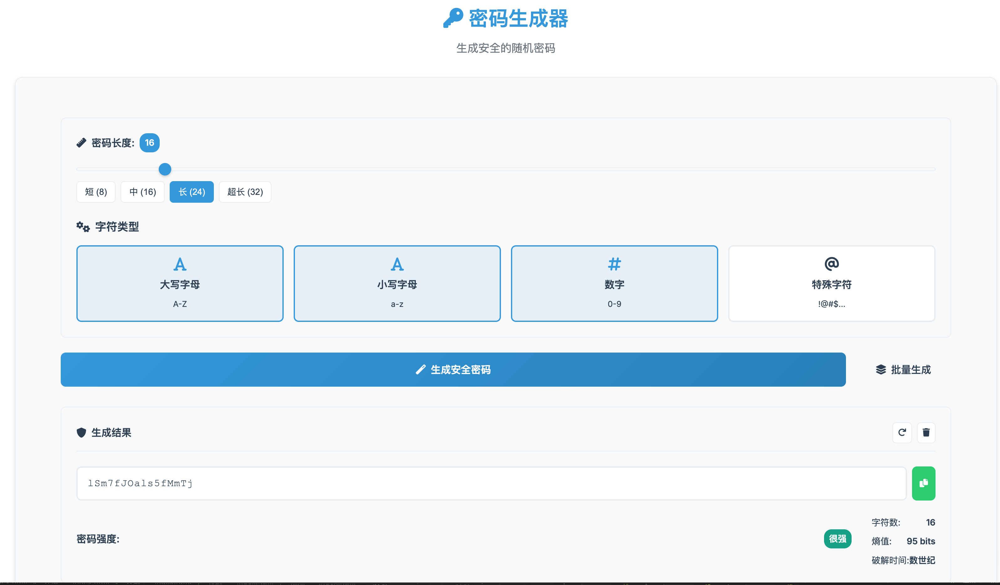
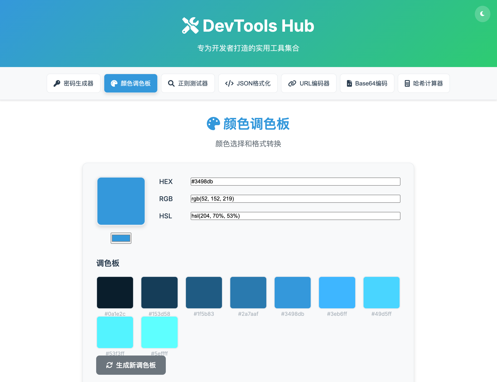

<div align="center">

# 🚀 DevTools Hub

### ⚡ 一站式开发者工具箱 | 纯前端 | 离线可用 | 开源免费

*让开发更高效，让工作更愉快*

[](https://github.com/wxingda/devtools-hub/stargazers)
[](https://github.com/wxingda/devtools-hub/network)
[](LICENSE)
[](https://wxingda.github.io/devtools-hub)

[](https://wxingda.github.io/devtools-hub)
[](https://github.com/wxingda/devtools-hub/archive/refs/heads/main.zip)

</div>

---

## � 项目亮点

<table>
<tr>
<td width="50%">

### 🎯 **为什么选择 DevTools Hub？**

✅ **完全离线** - 保护数据隐私，无需担心网络泄露  
✅ **响应式设计** - 完美适配所有设备  
✅ **现代化界面** - 精美的 UI/UX 设计  
✅ **零依赖** - 纯原生JavaScript，加载迅速  
✅ **开源免费** - MIT许可证，自由使用

</td>
<td width="50%">

### 📊 **项目数据**

🎨 **8+** 实用工具  
💻 **100%** 纯前端实现  
📱 **响应式** 移动端优化  
🌙 **深色模式** 护眼体验  
⚡ **<100KB** 轻量级应用

</td>
</tr>
</table>

## 🛠️ 功能工具

<div align="center">

| 工具 | 功能描述 | 特色功能 |
|:---:|:---|:---|
| 🔐 **密码生成器** | 生成安全的随机密码 | 可自定义长度、密码强度显示、一键复制 |
| 🎨 **颜色调色板** | 颜色选择和格式转换 | RGB/HEX/HSL转换、渐变色生成 |
| 🔍 **正则表达式测试器** | 实时测试和验证正则表达式 | 语法高亮、常用模板、匹配详情 |
| 📝 **JSON格式化器** | 美化和压缩JSON数据 | 语法验证、树状结构显示 |
| 🌐 **URL编码/解码器** | URL字符串编码解码 | 批量处理、实时预览 |
| 🔢 **Base64编码器** | Base64编码解码工具 | 文本/文件支持、拖拽上传 |
| 🧮 **哈希计算器** | MD5、SHA1、SHA256计算 | 多种算法、文件哈希 |
| ⏰ **时间戳转换器** | Unix时间戳转换 | 多格式转换、时区支持 |

</div>

### 🎨 界面预览

<div align="center">


</div>

## 🚀 快速上手

### 📱 在线体验（推荐）
> 🌟 **无需下载，立即使用！**

[](https://wxingda.github.io/devtools-hub)

### 💻 本地部署

#### 方法一：直接下载
```bash
# 1. 下载项目
git clone https://github.com/wxingda/devtools-hub.git
cd devtools-hub

# 2. 在浏览器中打开
open index.html  # macOS
start index.html  # Windows
xdg-open index.html  # Linux
```

#### 方法二：本地服务器
```bash
# 使用 Python
python -m http.server 8000

# 使用 Node.js
npx serve .

# 使用 PHP
php -S localhost:8000
```

### 🔧 PWA 安装
支持安装到桌面，像原生应用一样使用！

1. 访问在线版本
2. 点击浏览器地址栏的"安装"按钮
3. 确认安装到桌面

## 🛠 工具详情

### 🔐 密码生成器
- 可自定义长度（4-128位）
- 支持字母、数字、特殊字符组合
- 密码强度实时显示
- 一键复制功能

### 🎨 颜色调色板
- RGB、HEX、HSL格式转换
- 色彩预览
- 渐变色生成
- 色彩搭配建议

### 🔍 正则表达式测试器
- 实时匹配结果
- 语法高亮
- 常用正则模板
- 匹配组详情显示

### 📝 JSON格式化器
- 美化JSON数据
- 压缩JSON
- 语法验证
- 树状结构显示

## 🔧 技术栈

<div align="center">

| 技术 | 用途 | 版本 |
|:---:|:---|:---:|
|  | 页面结构 | 5 |
|  | 样式设计 | 3 |
|  | 交互逻辑 | ES6+ |
|  | 图标库 | 6.0 |
|  | 字体 | Inter |

</div>

### ⚡ 性能特点
- 🚀 **零依赖** - 纯原生JavaScript实现
- � **轻量级** - 总体积 < 100KB
- ⚡ **快速加载** - 首屏渲染 < 500ms
- 🔄 **实时响应** - 输入即时生效
- � **本地存储** - 保存用户偏好

## 🤝 参与贡献

我们欢迎并感谢每一个贡献者！🎉

### 🌟 如何贡献

<table>
<tr>
<td width="50%">

#### 📝 **代码贡献**
1. Fork 本仓库
2. 创建特性分支 (`git checkout -b feature/AmazingFeature`)
3. 提交更改 (`git commit -m 'Add some AmazingFeature'`)
4. 推送到分支 (`git push origin feature/AmazingFeature`)
5. 开启 Pull Request

</td>
<td width="50%">

#### 🐛 **问题反馈**
- [报告 Bug](https://github.com/wxingda/devtools-hub/issues/new?template=bug_report.md)
- [功能建议](https://github.com/wxingda/devtools-hub/issues/new?template=feature_request.md)
- [使用问题](https://github.com/wxingda/devtools-hub/discussions)

</td>
</tr>
</table>

### 🎯 贡献方向

- 🛠️ 添加新工具
- 🎨 优化界面设计
- 📱 改进移动端体验
- 🌍 多语言支持
- 📚 完善文档
- 🧪 编写测试

### 👥 贡献者

感谢所有贡献者的努力！❤️

<a href="https://github.com/wxingda/devtools-hub/graphs/contributors">
  
</a>

## �️ 开发路线图

### 🚧 正在开发
- [ ] 🌍 多语言支持 (英文/中文)
- [ ] 📱 PWA 应用 (可安装到桌面)
- [ ] ⌨️ 快捷键支持
- [ ] 📊 使用统计

### 🎯 计划功能
- [ ] 🔄 文本差异对比器
- [ ] 📷 二维码生成器
- [ ] 📐 CSS 单位转换器
- [ ] 🎨 CSS 代码美化器
- [ ] 📱 响应式设计测试器
- [ ] 🔍 SEO 标签生成器

### 💡 功能建议
有好的想法？[告诉我们](https://github.com/wxingda/devtools-hub/issues/new?template=feature_request.md)！

## 📊 项目统计

<div align="center">


</div>

## ⭐ Star 历史

[](https://star-history.com/#wxingda/devtools-hub&Date)

## � 许可证

本项目基于 [MIT](LICENSE) 许可证开源。

## 🙏 致谢

- 感谢 [Font Awesome](https://fontawesome.com/) 提供图标
- 感谢 [Google Fonts](https://fonts.google.com/) 提供字体
- 感谢所有贡献者和使用者的支持

---

<div align="center">

### 🌟 如果这个项目对你有帮助，请给个 Star！

[](https://github.com/wxingda/devtools-hub/stargazers)

**[🌐 在线体验](https://wxingda.github.io/devtools-hub)** •
**[📖 查看文档](https://github.com/wxingda/devtools-hub/wiki)** •
**[💬 参与讨论](https://github.com/wxingda/devtools-hub/discussions)** •
**[🐛 反馈问题](https://github.com/wxingda/devtools-hub/issues)**

*Made with ❤️ by developers, for developers*

[](https://github.com/wxingda)

</div>